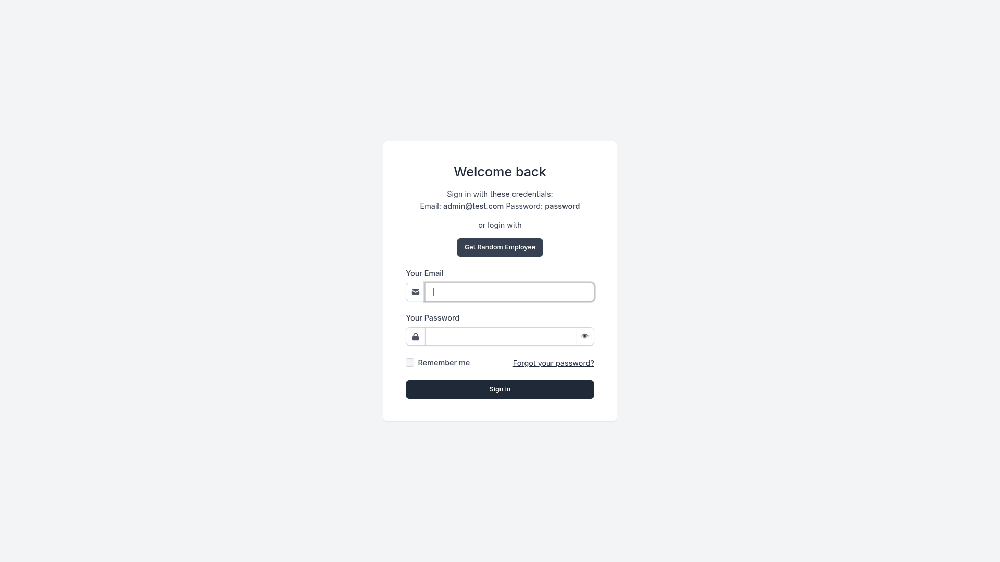
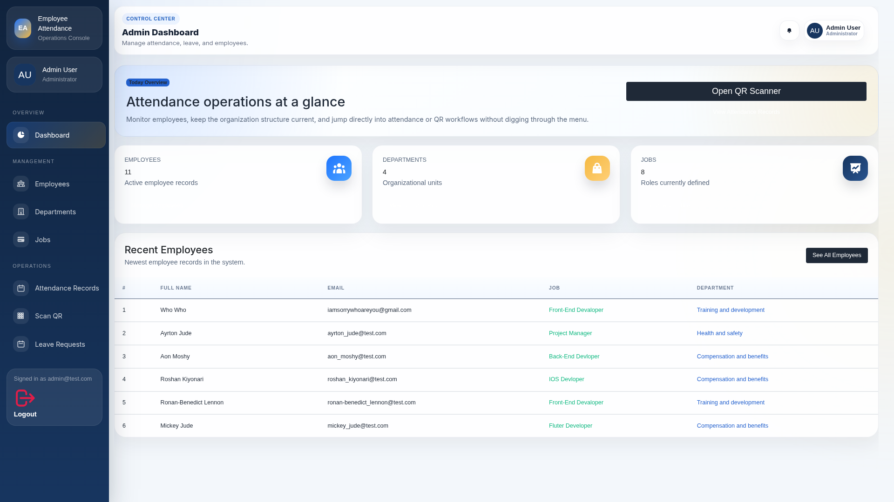
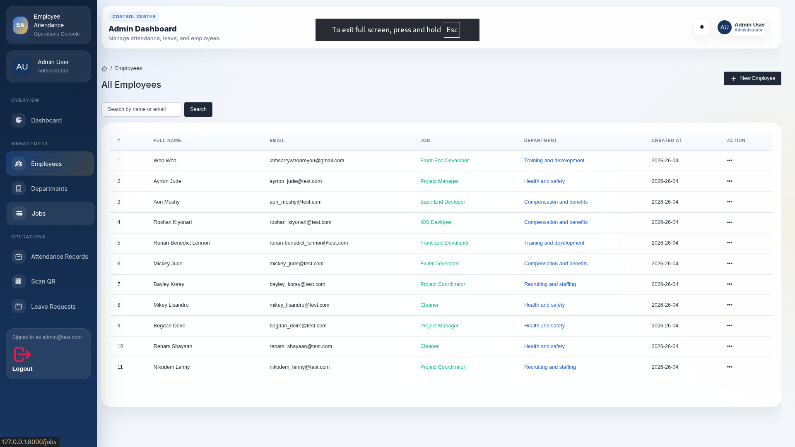
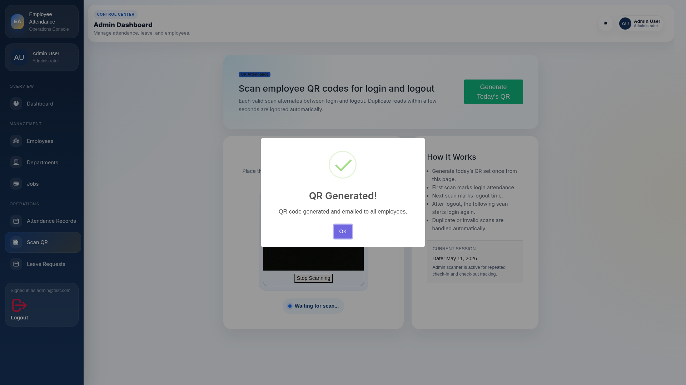
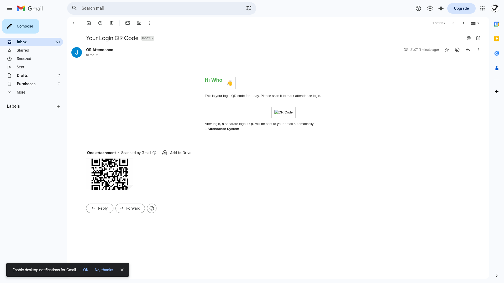
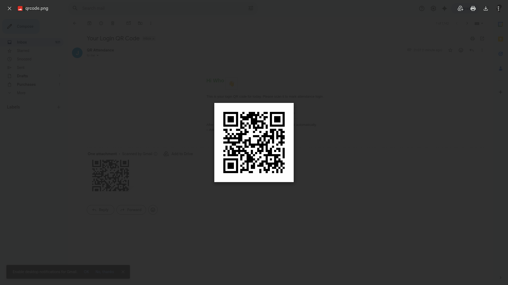
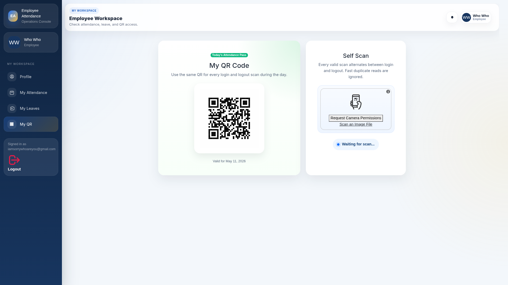
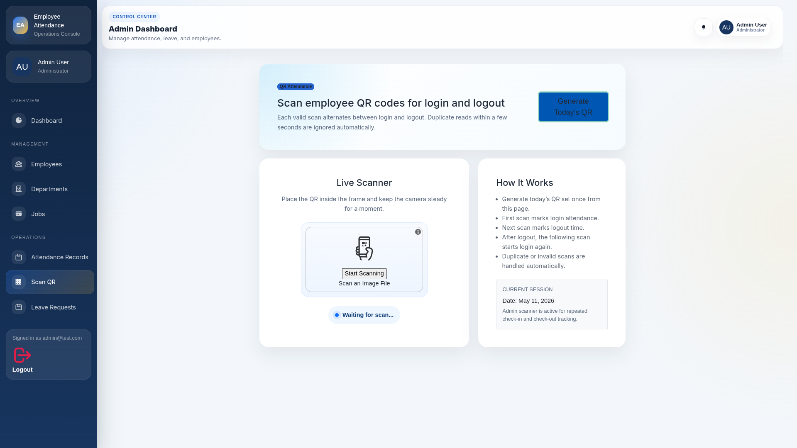

# Laravel ERP System Demo

Laravel ERP System Demo is an employee attendance and leave management application built with Laravel, Livewire, Bootstrap 5, and MySQL. It includes admin screens for managing employees, departments, jobs, attendance, QR attendance, leave requests, and attendance reports.










   
## Features

- Admin dashboard
- Employee registration and login
- Employee profile management
- Department management
- Job management
- Employee management
- Daily QR code based attendance
- QR scan attendance processing
- Employee attendance history
- Attendance complaints and admin fixes
- Leave request submission
- Leave request approval and rejection
- Attendance report page
- Attendance report PDF download
- Password reset flow

## Tech Stack

- Laravel 9
- PHP 7.3 or PHP 8+
- Livewire
- Bootstrap 5
- MySQL
- Laravel DOMPDF
- Simple QR Code

## Requirements

- PHP 7.3 or higher
- Composer
- Node.js and npm
- MySQL

## Installation

Clone the repository:

```bash
git clone https://github.com/DilaxScript/ERP-System.git
cd ERP-System
```

Install PHP dependencies:

```bash
composer install
```

Install frontend dependencies:

```bash
npm install
```

Create the environment file:

```bash
cp .env.example .env
```

Update the database settings in `.env`:

```env
DB_DATABASE=your_database_name
DB_USERNAME=your_database_user
DB_PASSWORD=your_database_password
```

Generate the application key:

```bash
php artisan key:generate
```

Run migrations:

```bash
php artisan migrate
```

If you want to import the included database file, import:

```text
laravel_employee-attendance.sql
```

Create the storage link:

```bash
php artisan storage:link
```

Build frontend assets:

```bash
npm run dev
```

Start the local server:

```bash
php artisan serve
```

Open the app:

```text
http://127.0.0.1:8000
```

## Main Routes

- `/login` - Login
- `/register` - Register
- `/profile` - Employee profile
- `/dashboard` - Admin dashboard
- `/departments` - Department management
- `/jobs` - Job management
- `/users` - Employee management
- `/attendances` - Attendance records
- `/take-attendance` - Attendance capture
- `/attendance-report` - Attendance reports
- `/attendance/report/pdf` - Download attendance report PDF
- `/my-leaves` - Employee leave requests
- `/leaves` - Admin leave management
- `/my-qr` - Employee QR code
- `/scan-qr` - Admin QR scanner

## Project Structure

```text
app/Http/Controllers      Application controllers
app/Http/Livewire         Livewire components
app/Models                Eloquent models
database                  Migrations, seeders, and factories
resources/views           Blade views
routes/web.php            Web routes
public                    Public assets
```

## License

This project is open-sourced software licensed under the MIT license.
